# Fruit & Vegetable Classification, CNNs vs. Vision Transformer

Image classification system that identifies fruits and vegetables from photos, comparing transfer learning with CNNs (InceptionV3, MobileNet, ResNet50V2) against a Vision Transformer (ViT). Built for the Digital Image Processing course of my MSc in Computer Engineering at UTAD.

<p align="center">
  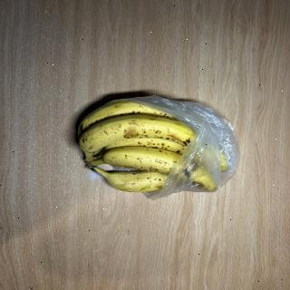
  
  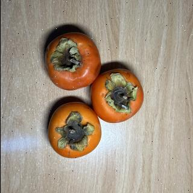
  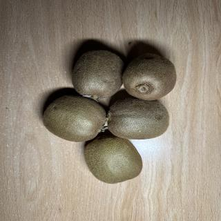
  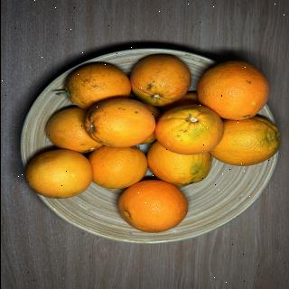
  <br/>
  <sub>Banana · Batata · Dióspiro · Kiwi · Laranja, the 5 classes in the self-collected dataset</sub>
</p>

## 🎯 Motivation

Self-checkout scales at supermarkets still require shoppers to manually look up and enter a code for loose fruits and vegetables, a step that is slow and a common source of pricing errors. This project explores whether a camera plus an image classification model could recognize the item automatically, skipping the manual code entry.

## 🧪 Two experiments, two datasets

This project ran the comparison twice, at two different scales:

**1. Own dataset**, 5 classes (Banana, Batata, Dióspiro, Kiwi, Laranja), collected and labeled by hand with [Roboflow](https://roboflow.com/), published publicly: **[Frutas dataset on Roboflow Universe](https://universe.roboflow.com/paulo-amorim-8cary/frutas-6sfk1)** (1966 images after augmentation, CC BY 4.0).

**2. Class-wide dataset**, 8 classes (the 5 above plus Lemon, Apple and Pear), combining the images collected by every group in the course. This dataset isn't included in this repository, both for size (~5GB) and because it contains photos contributed by other students, not solely by me.

## 📊 Results

### Own dataset (5 classes)

| Model | Test Accuracy |
|---|---|
| **InceptionV3** | **95.92%** |
| ResNet50V2 | 74.49% (see note below) |

<p align="center">
  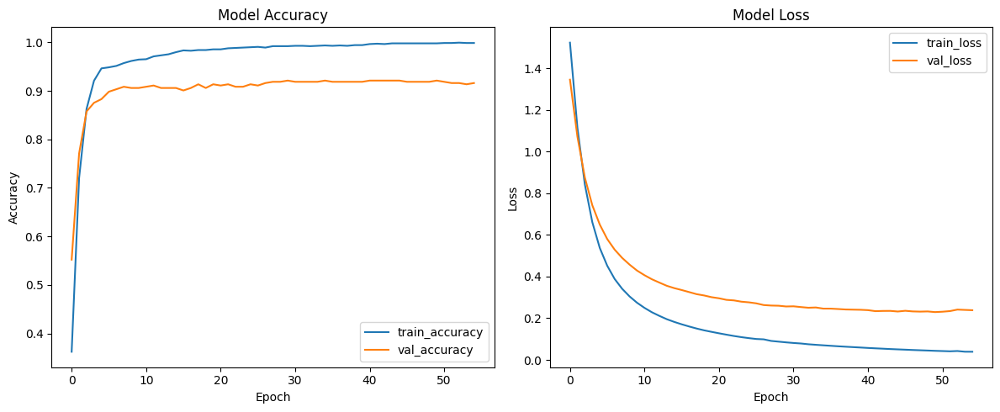
</p>
<p align="center">
  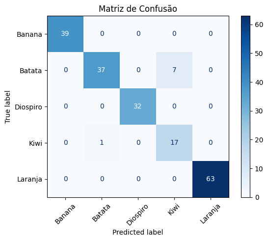
  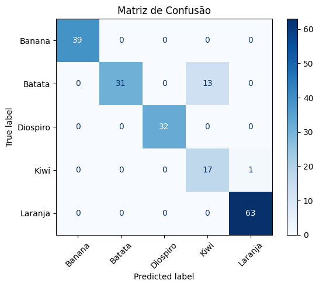
</p>

> Note: the 74.49% above is what `model.evaluate()` reported directly; the classification report computed from the predictions separately puts ResNet50V2 at 93% accuracy on the same test set. Both numbers are reported here rather than picking the more flattering one, the discrepancy is most likely an evaluation-pipeline inconsistency (for example a generator being consumed differently between the two calls) that would need isolating to fully explain.

### Class-wide dataset (8 classes)

| Model | Test Accuracy |
|---|---|
| **ViT** (`vit_tiny_patch16_224`) | **100%** |
| ResNet50V2 | 99.58% |
| MobileNet | 94.17% |

<p align="center">
  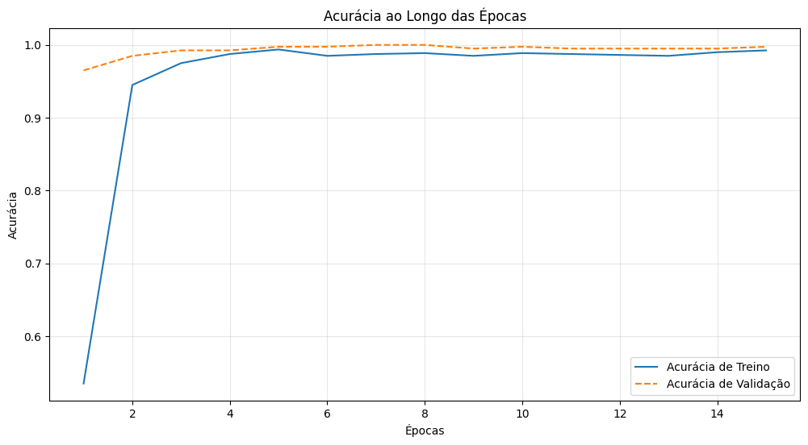
</p>
<p align="center">
  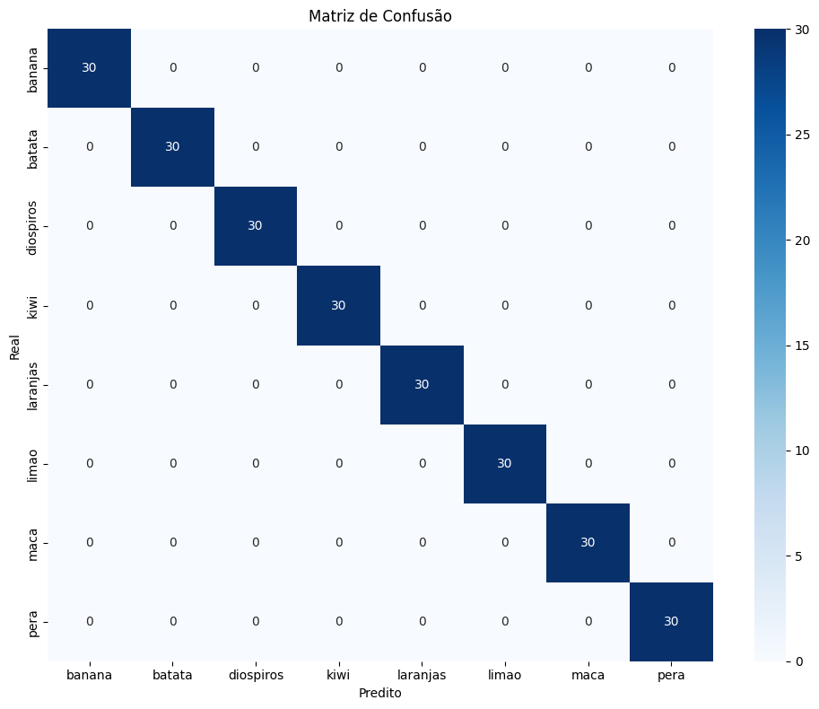
  
  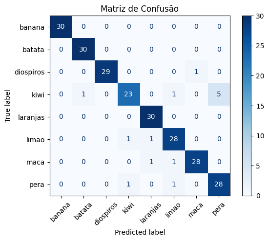
</p>

> Note on the near-perfect scores: both Roboflow datasets were split into train/validation/test *after* augmentation (rotations, exposure shifts, noise) rather than before. That means near-duplicate versions of the same source photo can end up on both sides of the split, which inflates test accuracy. These numbers are reported as obtained, but shouldn't be read as "a ViT solves 8-way fruit classification perfectly", a proper evaluation would re-split the data before augmenting.

## 🧠 Explainability (XAI)

High test accuracy doesn't say anything about *why* a model decided what it decided, so [LIME](https://github.com/marcotcr/lime) (Local Interpretable Model-agnostic Explanations) was used to inspect individual predictions, highlighting the image regions that most influenced each one.

**When it works**, on a clean studio photo from the own dataset, InceptionV3 classifies this as Banana with 99.96% confidence, and LIME confirms it's actually looking at the fruit itself:

<p align="center">
  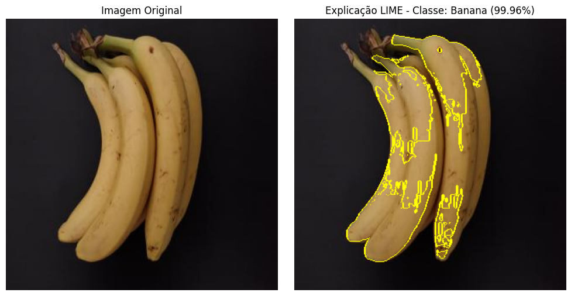
</p>

**Where it breaks down.** All the training photos have plain, uncluttered backgrounds. Testing on a photo closer to a real supermarket scenario, fruit still inside a plastic shopping bag, exposes the gap: this persimmon gets classified as orange with 97% confidence, and LIME shows why, part of what the model is reacting to is the plastic bag's texture and glare, not just the fruit:

<p align="center">
  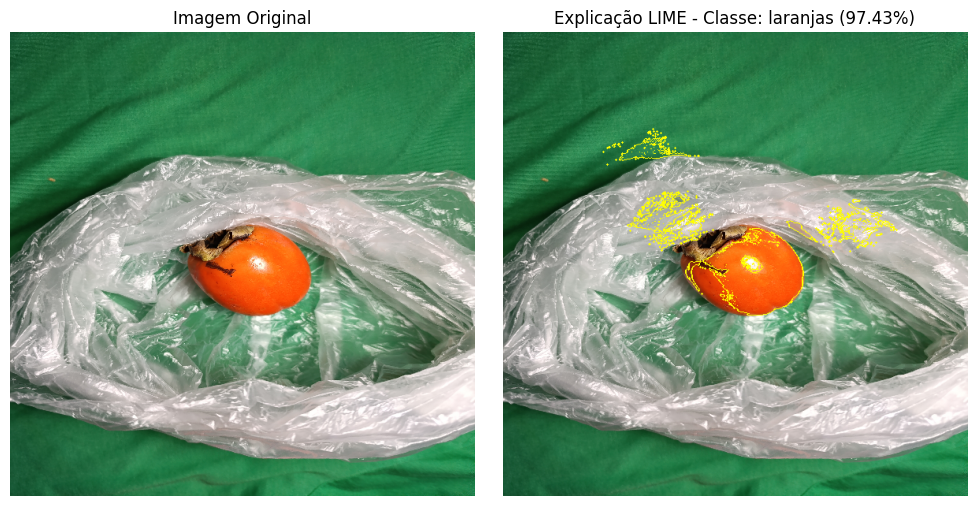
</p>

This connects directly to the near-perfect scores noted above, a model can look excellent on its own test set and still fail with high confidence the moment real-world conditions (lighting, packaging, clutter) stray from how the training photos were taken. Several more examples, one per class, are in the `classwide-dataset_mobilenet` notebook.

## 🧱 Approach

- **Transfer learning** with CNNs pretrained on ImageNet (InceptionV3, MobileNet, ResNet50V2), base layers frozen, a classification head trained on top.
- **Vision Transformer** (`vit_tiny_patch16_224`, via PyTorch/`timm`), trained with K-Fold cross-validation and a weighted random sampler to handle class imbalance.
- Standard evaluation throughout: accuracy/loss curves, confusion matrices, classification reports (precision/recall/F1), and ROC curves per class.

## 🛠️ Tech Stack

<p align="center">
  
  
  
  
  
  
  
</p>

## 📂 Repository structure

```
notebooks/   the 4 Colab notebooks, with outputs (training curves, confusion matrices, metrics)
scripts/     plain .py exports of 3 of the notebooks
assets/      result images used in this README
```

## 👤 About

Part of my portfolio. See my [GitHub profile](https://github.com/linho22w) for more projects in AI/ML and backend development.
